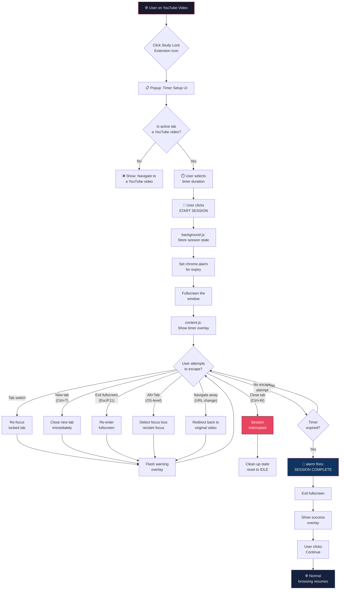

# Study Lock — Technical Product Requirement Document (PRD)

> **Version:** 1.0  
> **Date:** 2026-03-08  
> **Author:** Senior Full-Stack Engineer & UX Specialist  
> **Audience:** Technical Lead, Lead Developer (MVP Team)  
> **Status:** Draft — Pending Review

---

## Table of Contents

1. [Executive Summary](#1-executive-summary)
2. [Problem Statement & User Persona](#2-problem-statement--user-persona)
3. [Core Feature Logic](#3-core-feature-logic)
4. [Architecture Overview](#4-architecture-overview)
5. [Permissions Required](#5-permissions-required)
6. [API Integration — Deep Dive](#6-api-integration--deep-dive)
7. [Edge Case Handling](#7-edge-case-handling)
8. [UI/UX Specification](#8-uiux-specification)
9. [Development Sprints](#9-development-sprints)
10. [User Flow Diagram](#10-user-flow-diagram)
11. [Technical Constraints & Compliance](#11-technical-constraints--compliance)
12. [Risk Matrix](#12-risk-matrix)

---

## 1. Executive Summary

### The Value Prop

**Study Lock** is a Chrome extension that eliminates "distraction-drifting" for students who use YouTube as an educational tool. It creates a time-bounded, focused digital environment where the student's *only* option is to watch their selected video until a self-imposed timer expires.

**The Problem:**  
Students start an educational YouTube video with good intentions but quickly succumb to tab-switching, notification-checking, or window-minimizing. Attention is finite, and the browser is designed for *multitasking*, not *monotasking*.

**The Solution:**  
A non-destructive "Study Lock" mechanism that:

- Forces the YouTube tab to **fullscreen**.
- **Blocks tab-switching**, new tab creation, and window manipulation during a session.
- Runs a **visible countdown timer** overlay on the video.
- Automatically releases all restrictions when the timer expires.
- Provides a **"Success" celebratory state** to reinforce positive behavior.

**Non-Destructive Guarantee:**  
Study Lock never damages browser state, deletes data, or permanently modifies user settings. All restrictions are **transient, session-scoped, and automatically reversible**.

---

## 2. Problem Statement & User Persona

### Target User

| Attribute       | Detail                                              |
|-----------------|------------------------------------------------------|
| **Who**         | Students aged 16–28                                  |
| **Platform**    | Chrome browser (desktop only)                        |
| **Use Case**    | Watching educational YouTube videos (lectures, tutorials, courses) |
| **Pain Point**  | Distraction-drifting: opening new tabs, minimizing, alt-tabbing out |
| **Goal**        | Finish a study video in a single, uninterrupted session |

### Behavioral Insight

The student *wants* to focus. They lack the **environmental constraint** to enforce it. Study Lock is a **self-imposed constraint tool** — the digital equivalent of putting your phone in another room.

---

## 3. Core Feature Logic

### 3.1 Timer & Lock Mechanism — Technical Breakdown

The system operates on a **state machine** with four states:

```
IDLE → SETUP → LOCKED → COMPLETED
```

| State         | Description                                                                 |
|---------------|-----------------------------------------------------------------------------|
| `IDLE`        | Extension installed, no session active. Popup shows "Start Session" UI.    |
| `SETUP`       | User has clicked the extension on a YouTube tab. Timer overlay is shown.   |
| `LOCKED`      | Session is active. Tab is fullscreened, all escape routes are blocked.     |
| `COMPLETED`   | Timer has expired. All restrictions are removed. Success screen is shown.  |

### 3.2 State Persistence

Session state is stored in `chrome.storage.session` (Manifest V3 session-scoped storage):

```json
{
  "session_state": "LOCKED",
  "locked_tab_id": 1234,
  "locked_window_id": 5678,
  "timer_duration_seconds": 1800,
  "timer_remaining_seconds": 1423,
  "session_start_timestamp": 1709913106000,
  "original_url": "https://www.youtube.com/watch?v=dQw4w9WgXcQ"
}
```

> **Why `chrome.storage.session`?**  
> It persists across service worker restarts (critical for MV3 where background scripts can be terminated at any time) but is automatically wiped when the browser is closed, ensuring no stale locks persist.

### 3.3 Timer Execution

The timer is **dual-tracked**:

1. **Content Script (primary display):** A `setInterval` running in the YouTube tab's content script updates the visible countdown overlay every second.
2. **Service Worker (source of truth):** The background service worker stores `session_start_timestamp` and `timer_duration_seconds`. On every wake-up or event, it **recomputes** remaining time as:

```javascript
const elapsed = Date.now() - session_start_timestamp;
const remaining = timer_duration_seconds * 1000 - elapsed;
```

This architecture ensures the timer is **resilient to service worker hibernation** — it doesn't rely on a `setInterval` in the background.

---

## 4. Architecture Overview

### 4.1 File Structure

```
study-lock/
├── manifest.json              # Extension manifest (MV3)
├── background.js              # Service worker — session orchestrator
├── content.js                 # Injected into YouTube tabs — UI + timer
├── popup/
│   ├── popup.html             # Extension popup — session setup
│   ├── popup.js               # Popup logic
│   └── popup.css              # Popup styles
├── overlays/
│   ├── timer-overlay.html     # Timer UI template (injected via content script)
│   ├── success-overlay.html   # Success state UI template
│   └── overlay.css            # Overlay styles
├── assets/
│   ├── icon-16.png
│   ├── icon-48.png
│   ├── icon-128.png
│   └── success-animation.json # Lottie animation for success state
├── utils/
│   └── state-machine.js       # Shared state machine logic
└── styles.css                 # Global styles
```

### 4.2 Component Responsibility Matrix

| Component            | Responsibility                                                             |
|----------------------|----------------------------------------------------------------------------|
| **`background.js`**  | Session state management, tab/window event listeners, timer source of truth, alarm management, enforcing tab refocus and window constraints |
| **`content.js`**     | Inject timer overlay into YouTube page, display countdown, handle fullscreen request, render success screen, block keyboard shortcuts at DOM level |
| **`popup.js`**       | Timer setup UI, validate YouTube URL, initiate session, show session status |
| **`state-machine.js`** | Shared state transition logic (imported by both background and popup)   |

### 4.3 Communication Flow

```
┌─────────────┐    chrome.runtime.sendMessage     ┌──────────────┐
│   popup.js   │ ─────────────────────────────────►│ background.js │
│  (Setup UI)  │◄─────────────────────────────────│ (Orchestrator)│
└─────────────┘    chrome.runtime.onMessage        └──────┬───────┘
                                                          │
                                              chrome.tabs.sendMessage
                                                          │
                                                          ▼
                                                   ┌──────────────┐
                                                   │  content.js   │
                                                   │ (YouTube Tab) │
                                                   └──────────────┘
```

---

## 5. Permissions Required

### `manifest.json` — Permissions Block

```json
{
  "manifest_version": 3,
  "name": "Study Lock",
  "version": "1.0.0",
  "description": "Lock yourself into educational YouTube videos. Eliminate distraction-drifting.",
  "permissions": [
    "activeTab",
    "tabs",
    "storage",
    "alarms"
  ],
  "host_permissions": [
    "https://www.youtube.com/*"
  ],
  "background": {
    "service_worker": "background.js"
  },
  "content_scripts": [
    {
      "matches": ["https://www.youtube.com/*"],
      "js": ["content.js"],
      "css": ["styles.css"],
      "run_at": "document_idle"
    }
  ],
  "action": {
    "default_popup": "popup/popup.html",
    "default_icon": {
      "16": "assets/icon-16.png",
      "48": "assets/icon-48.png",
      "128": "assets/icon-128.png"
    }
  },
  "icons": {
    "16": "assets/icon-16.png",
    "48": "assets/icon-48.png",
    "128": "assets/icon-128.png"
  }
}
```

### Permission Justification

| Permission        | Why It's Needed                                                           |
|-------------------|---------------------------------------------------------------------------|
| `activeTab`       | Access the currently active tab to validate it's a YouTube URL and inject scripts |
| `tabs`            | Listen to `onActivated`, `onCreated`, `onRemoved` events to block tab escape |
| `storage`         | Persist session state in `chrome.storage.session` across service worker restarts |
| `alarms`          | Schedule a reliable alarm for when the timer expires (survives SW hibernation) |
| `host_permissions` (youtube.com) | Required to inject content scripts and access YouTube tab content |

> **Note:** We intentionally avoid requesting `notifications`, `system.display`, or `windows` unless absolutely necessary. The `chrome.windows` API functions used (like `update`) work with the `tabs` permission in most cases. If window focus enforcement requires the `windows` permission, it will be added.

---

## 6. API Integration — Deep Dive

### 6.1 Session Initialization (`background.js`)

When the user confirms the timer in the popup:

```javascript
// background.js — Session Start Handler
chrome.runtime.onMessage.addListener((message, sender, sendResponse) => {
  if (message.action === 'START_SESSION') {
    const { tabId, windowId, duration } = message;

    // 1. Store session state
    chrome.storage.session.set({
      session_state: 'LOCKED',
      locked_tab_id: tabId,
      locked_window_id: windowId,
      timer_duration_seconds: duration,
      timer_remaining_seconds: duration,
      session_start_timestamp: Date.now(),
    });

    // 2. Create an alarm for session expiry
    chrome.alarms.create('study-lock-timer', {
      delayInMinutes: duration / 60,
    });

    // 3. Focus the locked tab and make it fullscreen
    chrome.windows.update(windowId, { focused: true, state: 'fullscreen' });
    chrome.tabs.update(tabId, { active: true });

    // 4. Notify the content script to show the timer overlay
    chrome.tabs.sendMessage(tabId, {
      action: 'ACTIVATE_LOCK',
      duration: duration,
    });

    sendResponse({ success: true });
  }
});
```

### 6.2 Tab Escape Prevention (`background.js`)

```javascript
// Prevent tab switching during active session
chrome.tabs.onActivated.addListener(async (activeInfo) => {
  const session = await chrome.storage.session.get('session_state');
  if (session.session_state !== 'LOCKED') return;

  const { locked_tab_id } = await chrome.storage.session.get('locked_tab_id');

  if (activeInfo.tabId !== locked_tab_id) {
    // Immediately re-focus the locked tab
    chrome.tabs.update(locked_tab_id, { active: true });

    // Notify content script to flash a warning
    chrome.tabs.sendMessage(locked_tab_id, {
      action: 'SHOW_WARNING',
      message: '🔒 Focus Session Active — Stay on track!',
    });
  }
});

// Prevent new tab creation
chrome.tabs.onCreated.addListener(async (tab) => {
  const session = await chrome.storage.session.get('session_state');
  if (session.session_state !== 'LOCKED') return;

  // Close the newly created tab
  chrome.tabs.remove(tab.id);

  // Re-focus locked tab
  const { locked_tab_id } = await chrome.storage.session.get('locked_tab_id');
  chrome.tabs.update(locked_tab_id, { active: true });
});
```

### 6.3 Window Manipulation Prevention (`background.js`)

```javascript
// Prevent minimizing, resizing, or un-fullscreening
chrome.windows.onBoundsChanged?.addListener(async (window) => {
  const session = await chrome.storage.session.get([
    'session_state',
    'locked_window_id',
  ]);
  if (session.session_state !== 'LOCKED') return;

  if (window.id === session.locked_window_id && window.state !== 'fullscreen') {
    chrome.windows.update(session.locked_window_id, { state: 'fullscreen' });
  }
});

// Also handle focus changes — if user clicks outside Chrome
chrome.windows.onFocusChanged.addListener(async (windowId) => {
  const session = await chrome.storage.session.get([
    'session_state',
    'locked_window_id',
  ]);
  if (session.session_state !== 'LOCKED') return;

  if (windowId === chrome.windows.WINDOW_ID_NONE) {
    // User focused outside Chrome — bring it back
    chrome.windows.update(session.locked_window_id, { focused: true });
  } else if (windowId !== session.locked_window_id) {
    // User focused a different Chrome window
    chrome.windows.update(session.locked_window_id, { focused: true });
  }
});
```

### 6.4 Fullscreen API Integration (`content.js`)

```javascript
// content.js — Fullscreen handling
chrome.runtime.onMessage.addListener((message, sender, sendResponse) => {
  if (message.action === 'ACTIVATE_LOCK') {
    // Request fullscreen on the document element
    document.documentElement.requestFullscreen().catch((err) => {
      console.warn('Fullscreen request denied:', err);
      // Fallback: the background script handles window-level fullscreen
    });

    startTimerOverlay(message.duration);
  }
});

// Prevent exiting fullscreen via Escape key
document.addEventListener('fullscreenchange', () => {
  if (!document.fullscreenElement) {
    // User exited fullscreen — re-enter
    document.documentElement.requestFullscreen().catch(() => {});
  }
});
```

### 6.5 Alarm-Based Session Expiry (`background.js`)

```javascript
// Reliable timer using chrome.alarms (survives service worker hibernation)
chrome.alarms.onAlarm.addListener(async (alarm) => {
  if (alarm.name === 'study-lock-timer') {
    const session = await chrome.storage.session.get([
      'session_state',
      'locked_tab_id',
      'locked_window_id',
    ]);

    if (session.session_state !== 'LOCKED') return;

    // 1. Update state
    await chrome.storage.session.set({
      session_state: 'COMPLETED',
      timer_remaining_seconds: 0,
    });

    // 2. Exit fullscreen
    chrome.windows.update(session.locked_window_id, { state: 'normal' });

    // 3. Notify content script to show success screen
    chrome.tabs.sendMessage(session.locked_tab_id, {
      action: 'SESSION_COMPLETE',
    });
  }
});
```

---

## 7. Edge Case Handling

### 7.1 Browser Crash / Unexpected Termination

| Scenario                        | Handling Strategy                                                        |
|---------------------------------|--------------------------------------------------------------------------|
| **Browser crashes mid-session** | `chrome.storage.session` is wiped on browser close/crash. On next launch, state is `IDLE`. No stale lock. ✅ |
| **Service worker hibernates**   | Timer is driven by `chrome.alarms`, not `setInterval`. The alarm fires regardless of SW state. Remaining time is computed from `session_start_timestamp`, not a decrementing counter. ✅ |
| **Tab is closed by OS/crash**   | `chrome.tabs.onRemoved` listener detects the locked tab is gone. Session is force-ended with a "Session Interrupted" state (not "Completed"). ✅ |

```javascript
// Handle locked tab being closed unexpectedly
chrome.tabs.onRemoved.addListener(async (tabId) => {
  const session = await chrome.storage.session.get([
    'session_state',
    'locked_tab_id',
  ]);

  if (session.session_state === 'LOCKED' && tabId === session.locked_tab_id) {
    // Session was interrupted — clean up
    await chrome.storage.session.set({
      session_state: 'IDLE',
      timer_remaining_seconds: 0,
    });
    chrome.alarms.clear('study-lock-timer');
    console.warn('Study Lock: Session interrupted — locked tab was closed.');
  }
});
```

### 7.2 Keyboard Shortcut Escape Attempts

| Shortcut           | OS      | Mitigation                                                              |
|--------------------|---------|-------------------------------------------------------------------------|
| **Alt+Tab**        | Windows | **Cannot be intercepted by extensions.** Mitigation: `chrome.windows.onFocusChanged` detects focus loss and immediately calls `chrome.windows.update(windowId, { focused: true })` to reclaim focus. |
| **Cmd+Tab**        | macOS   | Same as above — OS-level shortcut, mitigated by focus-reclaim listener. |
| **Ctrl+T**         | All     | `chrome.tabs.onCreated` listener immediately closes the new tab.        |
| **Ctrl+W**         | All     | `chrome.tabs.onRemoved` listener detects tab close → ends session.      |
| **Ctrl+N**         | All     | New window → `chrome.windows.onCreated` can detect and close it, or `onFocusChanged` reclaims focus. |
| **Ctrl+Shift+N**   | All     | Incognito window — same handling via `onFocusChanged`.                  |
| **F11 (exit FS)**  | All     | Content script listens to `fullscreenchange` and re-enters fullscreen.  |
| **Escape**         | All     | `keydown` listener in content script intercepts and calls `preventDefault()`. Also re-enters fullscreen if exited. |
| **Ctrl+L** (address bar) | All | Cannot be fully blocked. But if user navigates away, `chrome.tabs.onUpdated` detects URL change and navigates back to original YouTube URL. |
| **Alt+F4**         | Windows | Closes the window entirely. Handled by `chrome.tabs.onRemoved` — session ends gracefully. |

```javascript
// content.js — Block Escape key and other shortcuts
document.addEventListener('keydown', (e) => {
  const blockedKeys = ['Escape', 'F11'];
  const blockedCombos = [
    { ctrl: true, key: 't' },  // Ctrl+T
    { ctrl: true, key: 'n' },  // Ctrl+N
    { ctrl: true, key: 'w' },  // Ctrl+W
    { ctrl: true, key: 'l' },  // Ctrl+L
    { ctrl: true, shift: true, key: 'n' }, // Ctrl+Shift+N
  ];

  if (blockedKeys.includes(e.key)) {
    e.preventDefault();
    e.stopPropagation();
    return;
  }

  for (const combo of blockedCombos) {
    if (
      combo.ctrl === e.ctrlKey &&
      (!combo.shift || combo.shift === e.shiftKey) &&
      combo.key === e.key.toLowerCase()
    ) {
      e.preventDefault();
      e.stopPropagation();
      return;
    }
  }
}, true); // 'true' = capture phase, fires before YouTube's handlers
```

> **⚠️ Important Limitation:**  
> Chrome extensions **cannot** intercept OS-level shortcuts (`Alt+Tab`, `Cmd+Tab`, Windows key). The mitigation is *reactive*, not *preventive* — we detect the user has left and pull them back. This is the industry-standard approach for "non-destructive" focus tools.

### 7.3 URL Navigation Away from YouTube

```javascript
// background.js — Prevent navigating away from the locked video
chrome.tabs.onUpdated.addListener(async (tabId, changeInfo) => {
  if (!changeInfo.url) return;

  const session = await chrome.storage.session.get([
    'session_state',
    'locked_tab_id',
    'original_url',
  ]);

  if (session.session_state === 'LOCKED' && tabId === session.locked_tab_id) {
    if (changeInfo.url !== session.original_url) {
      // Redirect back to the original video
      chrome.tabs.update(tabId, { url: session.original_url });
    }
  }
});
```

---

## 8. UI/UX Specification

### 8.1 Timer Setup Overlay (Popup)

The extension popup (`popup.html`) serves as the session setup screen.

#### Layout

```
┌─────────────────────────────────┐
│           🔒 STUDY LOCK         │
│                                 │
│   ┌─────────────────────────┐   │
│   │ Set Your Focus Timer    │   │
│   │                         │   │
│   │  ┌───┐   ┌───┐   ┌───┐ │   │
│   │  │ 15│   │ 30│   │ 45│ │   │  ← Quick presets (minutes)
│   │  │min│   │min│   │min│ │   │
│   │  └───┘   └───┘   └───┘ │   │
│   │                         │   │
│   │  ┌──────────────────┐   │   │
│   │  │ Custom: [__] min │   │   │  ← Manual input (5–120 min)
│   │  └──────────────────┘   │   │
│   │                         │   │
│   │  ┌──────────────────┐   │   │
│   │  │ 🚀 START SESSION │   │   │  ← Primary CTA
│   │  └──────────────────┘   │   │
│   │                         │   │
│   │  ⚠️ You won't be able   │   │
│   │  to exit until the      │   │
│   │  timer runs out.        │   │
│   └─────────────────────────┘   │
└─────────────────────────────────┘
```

#### Behavior

1. Popup opens → checks if the active tab is a YouTube video URL (`/watch?v=`).
2. **If not YouTube:** Shows a message: "Navigate to a YouTube video to start a session."
3. **If YouTube:** Shows the timer setup UI above.
4. User selects a duration → clicks **START SESSION**.
5. Popup sends `{ action: 'START_SESSION', tabId, windowId, duration }` to `background.js`.
6. Popup closes automatically.

#### Validation Rules

| Rule                          | Details                                   |
|-------------------------------|-------------------------------------------|
| Minimum duration              | 5 minutes                                 |
| Maximum duration              | 120 minutes (2 hours)                     |
| Allowed tab URL pattern       | `https://www.youtube.com/watch?v=*`       |
| Confirmation before start     | None (the warning text is sufficient)     |

### 8.2 Timer Overlay (Content Script — During Session)

Injected into the YouTube tab by `content.js`.

#### Layout

```
┌──────────────────────────────────────────────────────┐
│                                                      │
│                    [YouTube Video]                    │
│                                                      │
│                                                      │
│                                                      │
│                                                      │
│                                                      │
│ ┌──────────────────┐                                 │
│ │ 🔒 23:47         │  ← Floating timer (bottom-left) │
│ └──────────────────┘                                 │
└──────────────────────────────────────────────────────┘
```

#### Specifications

| Property                | Value                                                |
|-------------------------|------------------------------------------------------|
| **Position**            | Fixed, bottom-left corner, 20px padding              |
| **Appearance**          | Semi-transparent dark background (`rgba(0,0,0,0.7)`), white text, rounded corners, subtle glass blur |
| **Font**                | Monospace, 18px, `font-variant-numeric: tabular-nums` (prevents layout shift) |
| **Icon**                | 🔒 Lock emoji prefix                                |
| **Format**              | `MM:SS` countdown                                    |
| **Animation**           | Gentle pulse every 60 seconds. Red flash at < 60s remaining. |
| **Z-Index**             | `2147483647` (maximum, above all YouTube elements)   |
| **Interaction**         | Non-interactive (no click, no drag, no dismiss)      |
| **Pointer Events**      | `none` (clicks pass through to the video below)      |

### 8.3 Warning Flash Overlay

Triggered when the user attempts a blocked action (tab switch, new tab, etc.).

```
┌──────────────────────────────────────────────────────┐
│░░░░░░░░░░░░░░░░░░░░░░░░░░░░░░░░░░░░░░░░░░░░░░░░░░░░│
│░░░░░░░░░░░░░░░░░░░░░░░░░░░░░░░░░░░░░░░░░░░░░░░░░░░░│
│░░░░░░░░░░░░░░░░░░░░░░░░░░░░░░░░░░░░░░░░░░░░░░░░░░░░│
│░░░░░░░  🔒 Focus Session Active — Stay on   ░░░░░░░│
│░░░░░░░         track!                        ░░░░░░░│
│░░░░░░░░░░░░░░░░░░░░░░░░░░░░░░░░░░░░░░░░░░░░░░░░░░░░│
│░░░░░░░░░░░░░░░░░░░░░░░░░░░░░░░░░░░░░░░░░░░░░░░░░░░░│
└──────────────────────────────────────────────────────┘
```

| Property                | Value                                                |
|-------------------------|------------------------------------------------------|
| **Duration**            | 1.5 seconds, then fades out                          |
| **Background**          | Full-screen red-tinted overlay (`rgba(255,0,0,0.15)`) |
| **Text**                | Centered, bold, white, 24px                          |
| **Animation**           | Fade in (200ms) → Hold (1100ms) → Fade out (200ms)  |

### 8.4 Success State (Session Complete)

When the timer expires, the lock is released and a success overlay appears.

```
┌──────────────────────────────────────────────────────┐
│                                                      │
│                                                      │
│                   🎉                                 │
│            ┌──────────────────┐                      │
│            │  SESSION COMPLETE │                     │
│            └──────────────────┘                      │
│                                                      │
│         You stayed focused for 30 minutes!           │
│                                                      │
│            ┌──────────────────┐                      │
│            │    ✅ Continue    │                     │
│            └──────────────────┘                      │
│                                                      │
│          "Discipline is the bridge between           │
│            goals and accomplishment."                │
│                     — Jim Rohn                       │
│                                                      │
└──────────────────────────────────────────────────────┘
```

| Property                | Value                                                |
|-------------------------|------------------------------------------------------|
| **Trigger**             | `chrome.alarms` fires → background sends `SESSION_COMPLETE` to content script |
| **Background**          | Full-screen overlay with gradient (`#0f0c29 → #302b63 → #24243e`) |
| **Animation**           | Confetti burst (CSS-only or Lottie), scale-up text entrance |
| **"Continue" Button**   | Dismisses the overlay, exits fullscreen, returns to normal browsing |
| **Motivational Quote**  | Randomly selected from a curated array of 10–15 quotes |

---

## 9. Development Sprints

### Phase 1 — Foundation (Sprint 1: ~3 days)

**Goal:** Core infrastructure, manifest setup, basic service worker.

| Task                                                    | Owner         | Deliverable           |
|---------------------------------------------------------|---------------|-----------------------|
| Create project scaffold (file structure per §4.1)       | Lead Dev      | Project files         |
| Write `manifest.json` with all permissions (§5)         | Lead Dev      | `manifest.json`       |
| Implement state machine (`utils/state-machine.js`)      | Lead Dev      | State transition logic |
| Basic `background.js`: session storage read/write       | Lead Dev      | `background.js`       |
| Basic `popup.html/js`: timer setup UI (no locking yet)  | Lead Dev      | Popup UI              |
| Unit tests for state machine transitions                | Lead Dev      | Test suite            |

**Exit Criteria:** Extension loads in Chrome. Popup displays timer setup. State can be written/read from `chrome.storage.session`.

---

### Phase 2 — Lock Mechanism (Sprint 2: ~4 days)

**Goal:** Core locking functionality — tab enforcement, fullscreen, window control.

| Task                                                    | Owner         | Deliverable            |
|---------------------------------------------------------|---------------| ---------------------- |
| Implement `chrome.tabs.onActivated` tab-refocus logic   | Lead Dev      | Tab lock               |
| Implement `chrome.tabs.onCreated` new-tab blocking      | Lead Dev      | New tab prevention     |
| Implement `chrome.windows.onFocusChanged` focus reclaim | Lead Dev      | Window focus lock      |
| Implement Fullscreen API in `content.js`                | Lead Dev      | Fullscreen enforcement |
| Implement `fullscreenchange` re-entry listener          | Lead Dev      | Escape prevention      |
| Implement keyboard shortcut blocking (§7.2)             | Lead Dev      | Key interception       |
| Implement URL navigation prevention (§7.3)              | Lead Dev      | URL lock               |
| Implement `chrome.alarms` for reliable timer expiry     | Lead Dev      | Alarm-based timer      |
| Integration test: full lock→unlock cycle                | Lead Dev      | E2E test               |

**Exit Criteria:** A complete lock-to-unlock session works. User cannot escape via any tested vector. Timer triggers automatic unlock.

---

### Phase 3 — UI/UX Polish (Sprint 3: ~3 days)

**Goal:** Pixel-perfect overlays, animations, success state.

| Task                                                    | Owner         | Deliverable            |
|---------------------------------------------------------|---------------|------------------------|
| Design and implement timer overlay (§8.2)               | Frontend Dev  | Timer CSS/HTML         |
| Design and implement warning flash overlay (§8.3)       | Frontend Dev  | Warning animation      |
| Design and implement success state overlay (§8.4)       | Frontend Dev  | Success screen         |
| Add motivational quotes array and random selection      | Frontend Dev  | Quotes module          |
| Add confetti/celebration animation                      | Frontend Dev  | CSS/Lottie animation   |
| Polish popup.html styling                               | Frontend Dev  | Popup redesign         |
| Add monospace tabular-nums timer formatting             | Frontend Dev  | Timer polish           |

**Exit Criteria:** All overlays render correctly on YouTube. Animations are smooth. Success state is celebratory and satisfying.

---

### Phase 4 — Hardening & Release (Sprint 4: ~3 days)

**Goal:** Edge cases, testing, Chrome Web Store submission.

| Task                                                    | Owner         | Deliverable                    |
|---------------------------------------------------------|---------------|--------------------------------|
| Handle browser crash / tab close edge cases (§7.1)      | Lead Dev      | Resilience code                |
| Handle `chrome.tabs.onRemoved` for locked tab           | Lead Dev      | Graceful session end           |
| Test on Chrome Stable, Beta, Canary                     | QA            | Cross-version validation       |
| Test all keyboard shortcuts (§7.2 matrix)               | QA            | Test report                    |
| Performance audit (memory, CPU during lock)             | Lead Dev      | Performance report             |
| Write Chrome Web Store listing (description, screenshots) | PM          | Store listing                  |
| Create promotional icons (128px, 440x280 tile)          | Designer      | Store assets                   |
| Submit to Chrome Web Store for review                   | PM            | Submission                     |

**Exit Criteria:** Extension passes Chrome Web Store review. All edge cases handled. No memory leaks. No stale locks.

---

## 10. User Flow Diagram



---

## 11. Technical Constraints & Compliance

### Manifest V3 Compliance

| Constraint                              | Study Lock Compliance                                                     |
|-----------------------------------------|---------------------------------------------------------------------------|
| **No persistent background pages**      | ✅ Uses service worker (`background.js`), no persistent scripts            |
| **No remote code execution**            | ✅ All code is bundled locally, no `eval()`, no CDN scripts               |
| **No inline scripts in HTML**           | ✅ All scripts are in separate `.js` files, referenced via `<script src>` |
| **Content Security Policy**             | ✅ Default MV3 CSP is used (no overrides needed)                          |
| **Minimal permissions**                 | ✅ Only `activeTab`, `tabs`, `storage`, `alarms` — no `<all_urls>`        |
| **Host permissions scoped**             | ✅ Limited to `https://www.youtube.com/*` only                            |

### Non-Destructive Guarantees

| Guarantee                               | Implementation                                                            |
|-----------------------------------------|---------------------------------------------------------------------------|
| **No data modification**                | Extension never writes to YouTube's DOM beyond its own overlays           |
| **No external network requests**        | Extension makes zero HTTP requests to any server                          |
| **Automatic cleanup**                   | `chrome.storage.session` is wiped on browser close; no persistent locks   |
| **Graceful degradation**                | If any API call fails, the session ends rather than leaving the user stuck |
| **User can always close Chrome**        | `Alt+F4` / force-quit is never blocked. Session ends cleanly via `onRemoved`. |

---

## 12. Risk Matrix

| Risk                                     | Likelihood | Impact   | Mitigation                                                                |
|------------------------------------------|------------|----------|---------------------------------------------------------------------------|
| Chrome updates break `windows.update` API| Low        | High     | Pin to stable API surface; monitor Chrome release notes                   |
| `requestFullscreen()` requires user gesture | Medium   | Medium   | Initial call is triggered by user click in popup. Re-entry uses `fullscreenchange` listener. |
| Users find it too restrictive            | Medium     | Medium   | Phase 2+: Add "Emergency Exit" (hold button for 5s) with confirmation    |
| YouTube layout changes break overlay positioning | Medium | Low    | Use fixed positioning relative to viewport, not YouTube DOM elements      |
| Service worker hibernation causes timer drift | Low     | High    | Timer is alarm-based (`chrome.alarms`), not interval-based. Remaining time is **computed** from start timestamp, never decremented. |
| Chrome Web Store rejects for "controlling user behavior" | Low | Critical | Extension is user-initiated, opt-in, non-destructive. Include clear description in store listing. |

---

## Appendix A: Motivational Quotes Array

```javascript
const MOTIVATIONAL_QUOTES = [
  { text: "Discipline is the bridge between goals and accomplishment.", author: "Jim Rohn" },
  { text: "The secret of getting ahead is getting started.", author: "Mark Twain" },
  { text: "It does not matter how slowly you go as long as you do not stop.", author: "Confucius" },
  { text: "Focus on being productive instead of busy.", author: "Tim Ferriss" },
  { text: "The only way to do great work is to love what you do.", author: "Steve Jobs" },
  { text: "Success is the sum of small efforts, repeated day in and day out.", author: "Robert Collier" },
  { text: "Don't watch the clock; do what it does. Keep going.", author: "Sam Levenson" },
  { text: "You don't have to be great to start, but you have to start to be great.", author: "Zig Ziglar" },
  { text: "Believe you can and you're halfway there.", author: "Theodore Roosevelt" },
  { text: "The harder you work for something, the greater you'll feel when you achieve it.", author: "Anonymous" },
];
```

---

## Appendix B: Emergency Exit (Future — Phase 2+)

For users who genuinely need to exit (emergency, urgent notification):

1. User presses and **holds** a hidden "🔓 Emergency Exit" button (invisible until hovered at top-right) for **5 continuous seconds**.
2. A confirmation modal appears: *"Are you sure? Your session will not count as completed."*
3. If confirmed, session state is set to `INTERRUPTED`, all restrictions are removed.
4. The extension logs this for the user's self-reflection (optional stats feature).

> This ensures the extension is **never truly trapping** — it's a self-imposed discipline tool with a deliberate escape hatch.

---

*End of Document*
